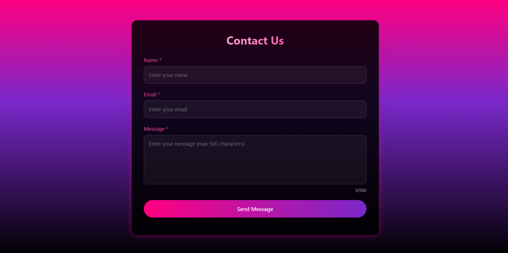

# 🌐 Modern Contact Form

A fully responsive and modern **Contact Form UI** built using **HTML, CSS, and JavaScript**.
It features a premium dark gradient design, real-time validation, loading animation, and success messages.

This project is ideal for **portfolio websites**, **frontend practice**, and **GitHub showcase**.

---

## 🚀 Live Demo

🔗 https://debarghya654.github.io/Contact-Form/

---

## 📌 Features

* ✅ Fully Responsive Design (Mobile, Tablet, Desktop)
* ✅ Modern Dark Gradient UI
* ✅ Real-time Form Validation
* ✅ Email Format Validation
* ✅ Loading Spinner Animation
* ✅ Success Message Display
* ✅ Character Counter (0–500)
* ✅ Prevent Multiple Submission
* ✅ Clean and Professional Layout

---

## 🛠️ Built With

* HTML5
* CSS3
* JavaScript (Vanilla JS)

---

## 📂 Project Structure

```
Contact-Form/
│
├── index.html
├── style.css
├── script.js
├── screenshot.png
└── README.md
```

---

## 📸 Screenshot



---

## ⚙️ How to Use

1. Clone the repository

```
git clone https://github.com/Debarghya654/Contact-Form
```

2. Open folder

```
cd Contact-Form
```

3. Open **index.html** in browser

---

## 🌍 GitHub Pages Hosting

This project is hosted using **GitHub Pages**.

To host yourself:

* Go to Repository Settings
* Click Pages
* Select Branch → main
* Save

---

## ⚠️ Note

This is a frontend-only project.

Form does not send email or store data.

You can integrate with:

* EmailJS
* Firebase
* Formspree
* Backend (PHP / Node.js)

---

## 👨‍💻 Author

**Debarghya Das**

* GitHub: https://github.com/Debarghya654
* LinkedIn: https://www.linkedin.com/in/debarghya-das-322a7a27a

---

## ⭐ Support

If you like this project:

Give it a ⭐ on GitHub

---

## 📄 License

This project is open source and free to use.
